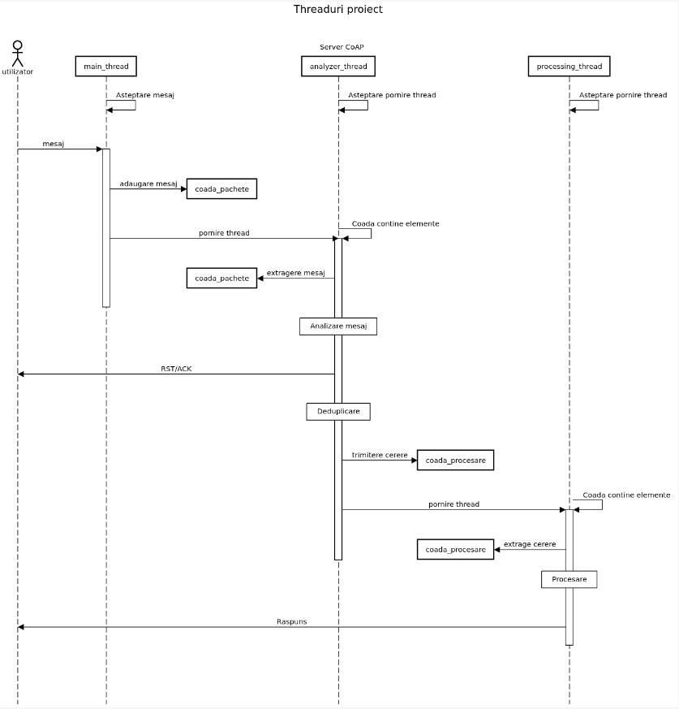

# _CoAP_

## Disclaimer

This project was developed with the guidance of a university professor, as part of a semester-long course.  
This repository is intended to showcase the final product of my work, rather than the development process itself.

--- 

CoAP (Constrained Application Protocol) este un 
protocol de comunicație ce rulează peste protocolul 
UDP/IP, fiind folosit în domenii cu resurse limitate 
de curent (putere consumată) și cu posibile pierderi 
de pachete de rețea (lossy networks).

## _Cuprins_

### [1.Caracteristici CoAP](#caracteristici-coap)
### [2.Model cerere/raspuns](#model-cerereraspuns)
### [3.Formatul mesajelor](#formatul-mesajelor)
### [4.Transmiterea mesajelor](#transmiterea-mesajelor)
### [5.Structura aplicatiei](#structura-aplicatiei)
### [6.Bibliografie](#bibliografie)


## Caracteristici CoAP

- ### Protocol web utilizat în comunicațiile M2M cu cerințe restrânse
- ### Schimb de mesaje asincrone
- ### Deduplicare și reorganizarea pachetelor
- ### O structură de date compactă și ușor de parsat

## Model cerere/raspuns

Cererile și raspunsurile sunt efectuate in mesajele CoAP, care includ fie un cod de metoda, fie un cod de raspuns. Informatiile optionale sunt transmise ca optiuni CoAP sau/și date privind pachetul, așa cum este specificat în formatul pachetului. O cerere este efectuata intr-un mesaj Confirmabil (CON) sau Neconfirmabil (NON) si, daca este disponibil imediat, raspunsul la o solicitare efectuata intr-un mesaj CON este piggybacked(adaugat la mesajul existent). Daca serverul nu este capabil sa raspunda imediat la o solicitare efectuata intr-un mesaj CON, acesta raspunde cu un mesaj ACK gol. Cand raspunsul este gata, serverul trimite un raspuns separat. Dacă o solicitare este trimisa intr-un mesaj NON, atunci raspunsul este trimis utilizand un mesaj NON nou. CoAP utilizeaza metodele GET, PUT, POST, DELETE si metoda RENAME implementata.

## Formatul Mesajelor
Mesajele CoAP sunt codificate intr-un format binar simplu. Formatul mesajului incepe cu un antet fix de 4 octeți. Acesta este urmat de o valoare Token cu lungime variabila, utilizata pentru a potrivi un raspuns la o solicitare. Urmand valoarea Token vine o secventa de zero sau mai multe optiuni CoAP in format Type-Length-Value (TLV), optional urmat de Payload Marker (0xFF) si Payload care se extinde până la sfarsitul datagramei UDP. Absenta marker-ului de Payload denotă un payload cu lungime zero.

```
0                   1                   2                   3
    0 1 2 3 4 5 6 7 8 9 0 1 2 3 4 5 6 7 8 9 0 1 2 3 4 5 6 7 8 9 0 1
   +-+-+-+-+-+-+-+-+-+-+-+-+-+-+-+-+-+-+-+-+-+-+-+-+-+-+-+-+-+-+-+-+
   |Ver| T |  TKL  |      Code     |          Message ID           |
   +-+-+-+-+-+-+-+-+-+-+-+-+-+-+-+-+-+-+-+-+-+-+-+-+-+-+-+-+-+-+-+-+
   |   Token (if any, TKL bytes) ...                               
   +-+-+-+-+-+-+-+-+-+-+-+-+-+-+-+-+-+-+-+-+-+-+-+-+-+-+-+-+-+-+-+-+
   |   Options (if any) ...                                       
   +-+-+-+-+-+-+-+-+-+-+-+-+-+-+-+-+-+-+-+-+-+-+-+-+-+-+-+-+-+-+-+-+
   |1 1 1 1 1 1 1 1|    Payload (if any) ...
   +-+-+-+-+-+-+-+-+-+-+-+-+-+-+-+-+-+-+-+-+-+-+-+-+-+-+-+-+-+-+-+-+
```
Versiune (Ver): 2 biti intregi fara semn. Indica numarul versiunii CoAP (01 binar).  
Tip (T): 2 biti intreg fara semn. Indica daca acest mesaj este de tip CON (0), NON (1), ACK (2) sau RST (3).  
Lungimea Tokenului (TKL): 4 biti intregi fara semn. Indica lungimea campului Token cu lungime variabila (0-8 octeți). Lungimile 9-15 sunt rezervate.  
Cod: 8 biti intregi fara semn, impartiti intr-o clasa de 3 biti si un detaliu pe 5 biti ca "c.dd" unde "c" poate fi de la 0 la 7 iar "dd" de la 00 la 31.  
Message ID: numar intreg fara semn pe 16 biti in ordine "network byte order" (big-endian).  
Fiecare instanta de optiune dintr-un mesaj specifica numarul de optiune al optiunii CoAP definite, lungimea valorii optiunii si valoarea optiunii in sine. In loc sa se specifice direct numarul de optiuni, instantele TREBUIE sa apara in ordinea numerelor de optiuni si se utilizează o codificare delta intre ele: nr. optiune anterioara + numar curent = nr. optiune curenta.   

```
   	  0   1   2   3   4   5   6   7
   	+---------------+---------------+
   	|  Option Delta | Option Length |   1 byte
   	+---------------+---------------+
   	|         Option Delta          |   0-2 bytes
   	|          (extended)           |
   	+-------------------------------+
   	|         Option Length         |   0-2 bytes
  	|          (extended)           |
  	+-------------------------------+
   	|         Option Value          |   0 or more bytes
   	+-------------------------------+
                  Format optiuni
```
- Option Delta: intreg fara semn pe 4 biti. O valoare intre 0 si 12 indica optiunea Delta. 13, 14, 15 sunt rezervate.
- Option Length: 4 biti intreg fara semn. O valoare intre 0 si 12 indică lungimea Valorii opțiunii, în octeți. 13, 14, 15 sunt rezervate. 
- Option Value: secventa de octeti de lungime Option Length (int, sir).

Transmiterea mesajelor CoAP este efectuata prin transporturi nesigure, mesajele pot sosi in alta ordine, sa apara duplicate sau sa dispara fara notificare. Din acest motiv, CoAP implementează un mecanism de fiabilitate care are următoarele caracteristici:

- Detectare duplicate.
- Regruparea pachetelor pentru încărcare.
- Solicitare de renuntare in cazul unui format nevalid sau corupt.

Transmiterea fiabilă a unui mesaj este inițiată prin marcarea mesajului ca CON în antetul CoAP. Un destinatar TREBUIE sa:  

Recunoasca un mesaj CON cu un mesaj ACK. 
Respinga mesajul dacă nu poate procesa corect mesajul.
Respingerea unui mesaj CON se efectuează prin trimiterea unui mesaj RST corespunzător. Mesajul ACK TREBUIE să aibă un răspuns sau să fie gol. Mesajul RST TREBUIE să fie gol.

## Transmiterea mesajelor

Payload-ul va fi in format JSON ca in exemplul de mai jos:   
```
{
    "action": "POST",
    "folder_path": "/path/to/folder",
    "folder_type": "txt",
    "content": [
        {
            "file_name": "document1",
            "file_size": "23KB",
            "file_content": "VGhpcyBpcyB0aGUgY29udGVudCBvZiB0aGUgZmlsZS4uLg==" 
        }
    ]
}
```
In cazul creeri unui director, campul content va fi lasat gol iar "folder type" va fi "dir".   

### Parametri: 
                   +-------------------+---------------+
                   | name              | default value |
                   +-------------------+---------------+
                   | ACK_TIMEOUT       | 2 seconds     |
                   | ACK_RANDOM_FACTOR | 1.5           |
                   | MAX_RETRANSMIT    | 4             |
                   | NSTART            | 1             |
                   | DEFAULT_LEISURE   | 5 seconds     |
                   | PROBING_RATE      | 1 byte/second |
                   +-------------------+---------------+

                     CoAP Protocol Parameters
### Metode utilizate:
| Cod  |  Nume  | 
|:----:|:------:|
| 0.01 |  GET   |       
| 0.02 |  POST  |       
| 0.03 |  PUT   |       
| 0.04 | DELETE |       
| 0.05 | RENAME |       

0.00 - mesaj gol

#### Coduri raspus:

| Cod  |              Nume               | 
|:----:|:-------------------------------:|
| 2.01 |             Created             |       
| 2.02 |             Deleted             |       
| 2.03 |              Valid              |       
| 2.04 | Changed (pentru POST si RENAME) |       
| 2.05 |             Content             |       
| 4.00 |           Bad request           |       
| 4.01 |          Unauthorized           |       
| 4.02 |           Bad Option            |       
| 4.03 |            Forbidden            |       
| 4.04 |            Not found            |       
| 4.05 |       Method not allowed        |       
| 4.06 |         Not Acceptable          |       
| 4.12 |       Precodition Failed        |       
| 4.13 |    Request Entity Too Large     |       
| 4.15 |    Unsuported Content-Format    |       
| 5.00 |      Internal Server Error      |       
| 5.01 |         Not Implemented         |       
| 5.02 |           Bad Gateway           |       
| 5.03 |       Service Unavailable       |       
| 5.04 |         Gateway Timeout         |       
| 5.05 |     Proxying Not Supported      |       


## Structura aplicatiei

Aplicatia poate fi reprezentata printr-o diagrama secventiala. Exista 3 thread-uri care indeplinesc 3 roluri:
- main thread: asteapta mesajele spre primire si pune in coada de pachete
- thread analizare: scoate din coada de mesaje cererile, le va trece printr-un filtru, iar dupa ce mesajul a fost  
deduplicat va fi adaugat intr-o coada de procesare pachete, iar de asemenea trimite raspunsuri de RST sau ACK
- thread procesare: va realiza procesarea cererilor si va trimite raspunsuri



## Bibliografie
https://docs.python.org/3/howto/sockets.html
https://docs.python.org/3/library/select.html
https://docs.python.org/3/library/threading.html   
https://sequencediagram.org/instructions.html  
https://datatracker.ietf.org/doc/html/rfc7252  
https://ocw.cs.pub.ro/courses/iothings/laboratoare/lab7
